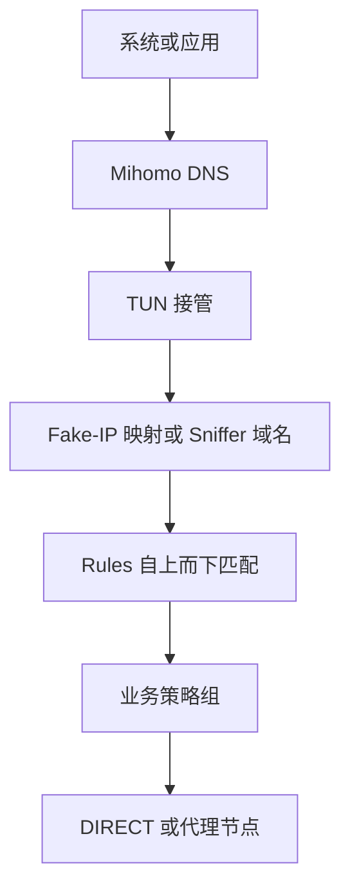

# mihomo-config

[](https://github.com/steveyu8749/mihomo-config/actions/workflows/validate.yml)

一份面向手机与电脑本机使用的 Mihomo TUN 配置模板。当前版本为 **V4.10**，目标是让 DNS、TUN、Sniffer、规则顺序和策略组之间的关系保持清晰、稳定、可验证。

这不是机场订阅转换模板，也不是自动测速方案。节点由用户手工选择，配置专注于分流语义和跨客户端一致性。

## 核心设计

| 模块 | 当前选择 | 设计目的 |
| --- | --- | --- |
| 运行模式 | `mode: rule` | 所有业务流量按规则与策略组决定出口 |
| DNS | 国内 DoH + Fake-IP | 降低污染影响，同时保留少量 Real-IP 兼容项 |
| TUN | `stack: mixed` | 兼顾桌面与移动端的兼容性 |
| Sniffer | 识别域名，不覆盖目标 | 补足少数缺失域名的连接信息，不改变实际连接地址 |
| 规则数据 | 公共 MRS + 自维护文本 Provider | 不依赖客户端内置 GeoData，并让个人例外保持可审计 |
| 节点选择 | 手工 `select` | 不维护地区筛选、自动测速或故障转移组 |
| 使用边界 | 仅本机，`allow-lan: false` | 不把代理端口暴露给局域网其他设备 |



Fake-IP / Real-IP 只决定 DNS 返回什么地址；DIRECT / PROXY 只由 `rules` 和策略组决定。这两个层面不要混为一谈。

## 使用前提

- 建议使用 **Mihomo Core v1.19.10 或更新版本**；
- CI 固定使用 **Mihomo v1.19.29** 做真实核心检查；
- 适用于 Clash Verge Rev 及其他支持 Mihomo 配置的桌面或移动端客户端；
- GUI 客户端可能合并或覆写 TUN、DNS、端口等字段，排障时应查看客户端的最终运行配置。

最低版本建议来自 Fake-IP TUN 下 DIRECT TCP / UDP 的 `direct-nameserver` 重解析行为。使用更旧的核心时，即使配置能载入，DNS 行为也可能不同。

## 快速开始

1. 下载 [`config.example.yaml`](./config.example.yaml)。
2. 将 `Provider_A`、`Provider_B`、`Provider_C` 中的 `订阅url` 替换为自己的订阅地址；不需要的 Provider 可以删除。
3. 按需维护 [`rules/Direct.list`](./rules/Direct.list) 与 [`rules/FakeIPFilter.list`](./rules/FakeIPFilter.list)；不需要个人扩展时直接使用仓库默认内容。
4. 处理 `proxylite`：有自定义规则就替换占位地址；没有就同时删除对应路由规则与 Rule Provider。
5. 将配置导入客户端并启用 TUN。
6. 在 `🚀 默认代理` 中选择一个实际代理节点；其他业务组默认继承它，也可以单独切换为硬直连。
7. 查看客户端的最终配置，确认没有被全局覆写脚本改掉 DNS、TUN 或策略组设置。

请勿把真实订阅地址、节点凭据、API 密钥或控制器密码提交到公开仓库。仓库策略校验会拦截常见的未脱敏内容，但不能代替人工确认。

## Proxy Provider 与策略组

### 机场订阅

机场订阅统一由 `proxy-providers` 管理：

- 每 5 小时刷新一次订阅；
- 每 10 分钟执行一次节点健康检查；
- 订阅文件使用 `proxy: 直连` 下载。

Proxy Provider 在首次启动时负责提供代理节点。如果下载订阅本身又依赖尚未加载的代理节点，就会形成启动循环。因此模板只让订阅文件固定硬直连；如果某个订阅地址确实无法直连，只调整该 Provider 的下载出口即可。

### 默认代理与业务组

`🚀 默认代理` 是唯一直接收纳全部代理节点的策略组：

```yaml
- name: 🚀 默认代理
  type: select
  include-all: true
  exclude-type: direct
```

`exclude-type: direct` 保证这个组始终表示代理出口，不会因为订阅或手工节点中出现 direct 类型而意外变成直连。

其他业务组不使用 `include-all`，只提供：

```yaml
proxies: [🚀 默认代理, 直连]
```

这样既能统一继承默认节点，又能把某个业务单独切换为硬直连。`store-selected: true` 会保存每个 `select` 组上次的选择。Apple 组的顺序相反，默认优先直连：

```yaml
proxies: [直连, 🚀 默认代理]
```

## TUN 与局域网

TUN 使用 `mixed` 网络栈，并接管普通 TCP / UDP 53 端口 DNS：

```yaml
tun:
  enable: true
  stack: mixed
  dns-hijack:
    - any:53
    - tcp://any:53
  auto-route: true
  auto-detect-interface: true
```

`route-exclude-address` 让 RFC1918 私网、链路本地、组播与广播地址完全绕过 TUN，主要用于降低访问路由器、NAS、投屏和局域网发现服务时的干扰。

`100.64.0.0/10` 默认保持注释。只有确认运营商 CGNAT、Tailscale 或其他软件要求该网段绕过 TUN 时再启用。

`allow-lan: false` 只表示其他局域网设备不能连接本机的代理端口，不等于本机无法访问局域网设备。两者属于不同方向的网络行为。

## DNS 与 Fake-IP

### 上游与 Bootstrap

主 DNS 使用国内 DoH：

```yaml
default-nameserver:
  - 223.5.5.5
  - 119.29.29.29
nameserver:
  - https://dns.alidns.com/dns-query
  - https://doh.pub/dns-query
direct-nameserver:
  - system
```

- `default-nameserver` 只负责解析 DoH 上游自身的域名；
- `nameserver` 负责普通查询；
- `direct-nameserver` 在规则最终判定为 DIRECT 时重新取得真实地址。

### Fake-IP Filter

模板采用规则模式：

```yaml
fake-ip-filter:
  - RULE-SET,private_domain,real-ip
  - RULE-SET,fakeip_compat,real-ip
  - MATCH,fake-ip
```

| 规则 | 作用 |
| --- | --- |
| `private_domain -> real-ip` | 私有、本地域名返回真实地址 |
| `fakeip_compat -> real-ip` | 少量经过确认的兼容项返回真实地址 |
| `MATCH -> fake-ip` | 其余域名，包括普通国内域名，统一返回 Fake-IP |

`fakeip_compat` 由 [`rules/FakeIPFilter.list`](./rules/FakeIPFilter.list) 维护，当前只包含：

```text
dns.msftncsi.com
+.googleapis.cn
+.xn--ngstr-lra8j.com
+.push.apple.com
+.market.xiaomi.com
+.pub.3gppnetwork.org
+.plex.direct
```

`+.googleapis.cn` 已包含 `services.googleapis.cn` 及其余子域，与 `+.xn--ngstr-lra8j.com` 一起处理部分 Android / 国行环境下 Google Play 下载等待或 CDN 选择异常；相关现象可参考 [OpenWrt-nikki #278](https://github.com/nikkinikki-org/OpenWrt-nikki/discussions/278)、[OpenClash #4443](https://github.com/vernesong/OpenClash/issues/4443) 与 [gfwlist #2472](https://github.com/gfwlist/gfwlist/issues/2472)。这些域名返回真实 IP 后仍由 `google_domain`、`google_ip` 和后续规则决定出口，不会因为进入 Fake-IP Filter 就自动直连。

其余例外也只解决明确的地址依赖：Windows NCSI 会验证 DNS 探测结果；APNs 系统连接可能需要可直接使用的真实端点；`plex.direct` 本身会解析到 Plex 服务器的局域网地址，Fake-IP 会破坏本地安全直连；小米项保留应用商店与天气组件的已知兼容处理。可分别参照 [Microsoft NCSI 指南](https://learn.microsoft.com/en-us/troubleshoot/windows-server/networking/troubleshoot-ncsi-guidance)、[Apple APNs 网络要求](https://support.apple.com/guide/deployment/configure-devices-to-work-with-apns-dep2de55389a/web) 与 [Plex 安全连接说明](https://support.plex.tv/articles/206225077-how-to-use-secure-server-connections/)。

`+.pub.3gppnetwork.org` 专门处理 Wi-Fi Calling。手机会访问形如 `ss.epdg.epc.mnc260.mcc310.pub.3gppnetwork.org` 的运营商 ePDG 主机，并通过 UDP 500/4500 建立 IKE/IPsec 隧道；Fake-IP 可能使隧道无法发起。已有 [OpenClash #3884](https://github.com/vernesong/OpenClash/issues/3884) 记录了 Fake-IP 失败、切换 Redir-Host 后恢复的完整复现。这里没有使用范围更大的 `+.3gppnetwork.org`。

Xbox 的四种传统主机模式保留为 `FakeIPFilter.list` 中的注释候选，没有默认启用。多份现有列表都包含它们，但 Mihomo 社区目前只能支持“P2P / NAT / QoS 场景可能需要真实端点”这一判断，不能证明默认使用 Fake-IP 必然故障。只有实际出现联机、派对语音或 NAT 检测异常，并确认根因是 Fake-IP 时才启用；Xbox 的日常分流仍由独立的 `xbox_domain` 和 `🪟 Microsoft` 组处理。

不会引入整套第三方 Fake-IP Filter，也不增加 NTP、通用 STUN、普通游戏、音乐、普通国内外域名或整类厂商集合。网上常见的 ShellCrash、qichiyuhub、wwqgtxx 与 silver716 列表之间存在继承关系，重复出现不能代替故障证据。只有出现可稳定复现、并确认根因是“应用收到 Fake-IP”而不是路由出口错误时，才加入最小范围的例外。

Real-IP 例外不决定出口。例如 `push.apple.com` 返回真实 IP 后，实际连接仍会命中 `🍎 Apple` 规则。

### `private_ip` 与 Fake-IP 地址池

路由规则还包含：

```yaml
- RULE-SET,private_ip,直连,no-resolve
```

它是规则层兜底，负责 mixed / redir / tproxy 等入口以及没有被 TUN 路由排除覆盖的私有或保留地址。`no-resolve` 防止这条 IP 规则为了匹配而主动解析域名。

MetaCubeX 的 `private.mrs` 包含 `198.18.0.0/15`，而默认 Fake-IP 池 `198.18.0.1/16` 位于其中。这里不会把普通 Fake-IP 域名误判为私网：Mihomo 在规则匹配前会先从 Fake-IP 恢复域名，并清空作为映射占位的目标 IP；随后域名规则正常参与匹配。这个行为已按 v1.19.29 核心实现复核。

### `respect-rules`

模板不启用 `respect-rules`。

普通业务流量在 `mode: rule` 下本来就会遵循 `rules`。`respect-rules` 控制的是 Mihomo 连接 DNS 上游时，DNS 上游连接本身是否也进入路由规则；它不会让“节点自行解析的所有流量”突然多遵循一次规则。

当前 AliDNS 与 DNSPod DoH 适合直接访问，启用该选项没有明确收益，还需要正确设置 `proxy-server-nameserver`，避免解析代理节点域名时形成启动依赖。以后如果把主 DNS 改为必须经代理访问的境外 DoH，再重新评估。

### `cache-algorithm`

Mihomo 支持 `lru` 与 `arc`：默认是 LRU，ARC 是可选算法。V4.10 不显式设置 `cache-algorithm`，继续使用默认 LRU。

ARC 并不等于无条件更快。没有观测到 DNS 缓存频繁抖动、也没有针对设备内存与访问模式做测量时，增加该参数只会扩大配置变量，难以证明实际收益。如果以后有明确的缓存命中问题，可以单独测试：

```yaml
cache-algorithm: arc
```

## Sniffer

Sniffer 的原则是“只识别，不改目标”：

```yaml
sniffer:
  enable: true
  parse-pure-ip: true
  override-destination: false
```

HTTP Host、TLS SNI 与 QUIC 握手信息只用于补充域名识别和规则匹配。当前不设置 `skip-domain`；只有问题可以稳定复现并确认由嗅探造成时，才添加最小范围的例外。

模板也不启用 `force-dns-mapping`。该选项主要用于强制嗅探带有 Redir-Host DNSMapping 的连接，而本模板以 Fake-IP 为主，`parse-pure-ip` 已负责纯 IP 流量的兜底识别。

## 分流规则

Mihomo 从上到下匹配，命中后停止。V4.10 的顺序是：

1. 私有域名与私有 IP；
2. 进程规则；
3. 具体业务域名；
4. 自维护 Direct；
5. 自定义 ProxyLite；
6. GFW、非中国与中国域名；
7. 业务 IP 兜底；
8. 中国 IP 兜底；
9. `MATCH`。

### 专用规则必须优先

| 优先规则 | 后置的宽泛规则 | 原因 |
| --- | --- | --- |
| Bing / MSN / Xbox | Microsoft | 保留用户重视的独立入口与清晰日志 |
| OneDrive | Microsoft | 网页版进入 OneDrive 组，不被 Microsoft 提前接管 |
| GitHub | Microsoft | `microsoft.mrs` 包含 GitHub 域名 |
| YouTube | Google | 保留 YouTube 独立策略组 |
| 非中国域名 | 中国域名 | 避免交叉集合先被直连命中 |

ProxyLite 位于所有专用业务域名之后、GFW / 地域规则之前。自定义规则集的内容由用户维护，范围可能很宽；如果它放在前面，可能抢先命中 Bing、OneDrive、GitHub、Microsoft、Apple 等域名，使专用策略组失效。

### 自维护 Direct

[`rules/Direct.list`](./rules/Direct.list) 使用 `behavior: domain` 与 `format: text`。初始 21 条规则合并了原来的 ScienceDirect、Elsevier、Clarivate / Web of Science 三个 Provider，因此主配置只保留一个下载入口和一条路由规则：

```yaml
- RULE-SET,direct_domain,直连
```

它位于全部专用业务规则之后、ProxyLite 与宽泛地域规则之前。这样新增的普通直连例外会优先于 ProxyLite，但不会抢走 Google、Microsoft、Apple、OneDrive 等已经明确分组的服务。

这 21 条已与 [V2Fly `domain-list-community`](https://github.com/v2fly/domain-list-community/tree/master/data) 的 `sciencedirect`、`elsevier`、`clarivate`（含 `sci`）逐条核对，也与 [MetaCubeX MRS](https://github.com/MetaCubeX/meta-rules-dat/tree/meta/geo/geosite) 和 [blackmatrix7 Scholar](https://github.com/blackmatrix7/ios_rule_script/tree/master/rule/Clash/Scholar) 交叉比较。当前没有扩大列表：blackmatrix7 的 Direct / Scholar 还包含普通学术站点、Google、Apple、PT 与进程规则，它们并不等于“必须硬直连”。

不要把完整 `cn_domain`、`cn_ip` 已覆盖的内容复制进来。只有明确要求硬直连、现有 Provider 没有正确处理的域名才应加入；如果一个域名需要独立策略组，就不应放进 Direct。

### AI 聚合集合

`🤖 ChatGPT` 当前使用 `category-ai-!cn.mrs`，它是境外 AI 聚合集合，不是 OpenAI 专用集合。经本次规则数据复核，其中包含 OpenAI、Claude / Anthropic、Copilot、Gemini、Perplexity 等域名，因此这些服务都会优先进入 ChatGPT 组。

### OneDrive 的特殊处理

```yaml
- PROCESS-NAME,onedrive.exe,直连
- RULE-SET,onedrive_domain,🐬 OneDrive
```

| 场景 | 结果 |
| --- | --- |
| Windows `OneDrive.exe` 本地客户端 | 硬直连 |
| 浏览器访问 OneDrive | `🐬 OneDrive` 策略组 |

浏览器不会命中 `onedrive.exe` 进程规则，所以网页版仍可选择代理。这正是模板的有意设计。

### Apple

Apple 使用完整 `apple.mrs`，而不是只使用中国区子集：

```yaml
- DOMAIN-SUFFIX,push.apple.com,🍎 Apple
- RULE-SET,apple_domain,🍎 Apple
- RULE-SET,apple_ip,🍎 Apple,no-resolve
```

Apple 域名默认直连，异常时可在 `🍎 Apple` 组切换为默认代理。完整域名集合负责大多数连接，`apple_ip,no-resolve` 只兜底已经拥有真实目标 IP 的流量，不为域名主动解析 IP。

### 国内 IP 兜底

`cn_ip` 有意不使用 `no-resolve`：

```yaml
- RULE-SET,cn_ip,直连
```

未命中前面域名规则的目标可以在这里解析真实 IP。解析为中国 IP 时直连，否则继续进入 `MATCH`。代价是少量未知域名首次连接时可能多一次解析，收益是保留国内 IP 兜底能力。

### 进程规则

两种常用规则格式如下：

```text
PROCESS-NAME,进程名或包名,目标策略组
PROCESS-NAME-REGEX,正则表达式,目标策略组
```

`PROCESS-NAME` 执行忽略大小写的精确匹配：

```yaml
- PROCESS-NAME,onedrive.exe,直连
- PROCESS-NAME,com.microsoft.bing,🪟 Microsoft
```

`PROCESS-NAME-REGEX` 执行忽略大小写的正则匹配：

```yaml
- PROCESS-NAME-REGEX,.*spotify.*,直连
- PROCESS-NAME-REGEX,^spotify(?:\.exe)?$,直连
```

第一条匹配名称或 Android 包名中任何包含 `spotify` 的进程；第二条只匹配 `spotify` 或 `spotify.exe`。已知稳定名称时优先使用精确匹配；只有确实存在多个变体时才使用正则。简单的 `*`、`?` 通配也可以改用更易读的 `PROCESS-NAME-WILDCARD`。

当前 `.*xboxone.*` 只覆盖名称或包名中含 `xboxone` 的目标，并不代表全部 Xbox 相关 Windows 进程。扩展前应先从客户端连接记录确认真实进程名，避免使用过宽的正则。

进程规则依赖操作系统或客户端提供进程信息。桌面端 TUN 通常可用，Android 可匹配包名；部署在路由器上的 Mihomo 通常无法识别下游终端进程，因此不会命中这些规则。`find-process-mode: strict` 会在规则需要时查询进程信息。

## Rule Provider

| 数据类型 | 配置 |
| --- | --- |
| 公共域名集合 | `behavior: domain` + `format: mrs` |
| 服务 / 中国 IP | `behavior: ipcidr` + `format: mrs` |
| 自维护 Direct | `behavior: domain` + `format: text` |
| 自定义 ProxyLite | `behavior: classical` + `format: text` |
| Fake-IP 兼容集合 | `behavior: domain` + `format: text` |

HTTP Rule Provider 每 24 小时更新。模板没有给它们设置 `proxy`，因此不会强制固定 DIRECT 或某个代理组；更新请求作为 Mihomo 内部连接进入正常路由。已有规则数据时，下载域名会按当前规则选择出口；首次启动或缓存为空时，最终结果也会受当时已可用的规则与兜底策略影响。

这与 Proxy Provider 不同：机场订阅需要先提供代理节点，所以模板为它明确设置硬直连，避免循环依赖。

所有启用的 MetaCubeX MRS URL 已在本次 V4.10 复审中检查存在性，格式与声明的 `behavior` 一致；两个自维护文本列表会在 CI 中额外转换为 MRS，以验证 Mihomo 能实际解析。

## Adobe：默认完全关闭

Adobe 屏蔽规则只计划在电脑上使用，因此公共手机 / 电脑模板默认不加载、不下载。桌面端需要时，必须同时取消三处注释：

1. `RULE-SET,adobeisdumb,REJECT`；
2. `yaml: &yaml ...` 锚点；
3. `adobeisdumb: {<<: *yaml, ...}` Rule Provider。

只启用其中一处会造成引用缺失或无效配置。

## 为什么使用 MRS，而不是 GeoData

模板不配置 `GEOSITE`、`GEOIP`、`geodata-mode`、`geo-auto-update` 或 `geox-url`，原因是：

- 手机与电脑引用完全相同的数据源；
- 不依赖不同客户端内置 GeoData 的版本和标签完整性；
- 规则来源、格式、更新周期和引用关系可以直接审计；
- MRS 在本地匹配，不会在每次连接时访问规则源。

## 限制与排障边界

- TUN 的 DNS 劫持主要针对普通 TCP / UDP 53，不能保证拦截应用内置 DoH / DoQ；
- 公共 DNS 不一定能解析家庭路由器自定义的局域网域名；
- `ipv6: false` 是当前兼容性基线，需要 IPv6 时应同时审查 DNS、TUN、路由排除与规则数据；
- 没有地区节点筛选、`url-test`、`fallback` 或负载均衡；
- Sniffer 不覆盖目标，因此极少数只有 IP、且无法嗅探域名的连接只能依赖 IP 规则；
- GUI 合并后的最终配置优先于模板文件，出现差异时先检查客户端覆写。

## 自动校验

安装固定版本依赖：

```bash
python3 -m pip install PyYAML==6.0.3
```

执行仓库策略检查：

```bash
python3 scripts/validate_config.py config.example.yaml
```

校验器会检查：

- YAML 重复键、顶层字段与公开模板脱敏；
- 策略组、规则目标和 Rule Provider 引用完整性；
- MRS Provider 的类型、格式、URL 与更新周期；
- 自维护 Direct / Fake-IP 文本列表的语法、重复项和必要条目；
- ProxyLite、Microsoft、Google、Apple 和 IP 兜底的关键顺序；
- DNS、TUN、Sniffer 与进程正则约束；
- 配置中每个活动字段是否带说明注释；
- README、设计说明、Changelog 与 CI 版本是否同步。

如果本地已安装 Mihomo，再执行核心检查：

```bash
mkdir -p /tmp/mihomo-config-test
mihomo -t -d /tmp/mihomo-config-test -f config.example.yaml
```

GitHub Actions 会运行相同的仓库策略校验，并下载经过 GitHub 发布摘要校验的 Mihomo v1.19.29 执行真实核心测试。

## 文件说明

| 文件 | 作用 |
| --- | --- |
| [`config.example.yaml`](./config.example.yaml) | 公开、脱敏、逐字段注释的主配置模板 |
| [`rules/Direct.list`](./rules/Direct.list) | 明确需要硬直连的最小域名例外，含合并后的科研资源 |
| [`rules/FakeIPFilter.list`](./rules/FakeIPFilter.list) | 仅解决应用无法接受 Fake-IP 的 Real-IP 兼容项 |
| [`scripts/validate_config.py`](./scripts/validate_config.py) | 仓库设计约束、引用完整性和脱敏检查 |
| [`scripts/test_validator.py`](./scripts/test_validator.py) | 校验器故障注入与回归测试 |
| [`.github/workflows/validate.yml`](./.github/workflows/validate.yml) | GitHub Actions 自动校验 |
| [`docs/design-notes.md`](./docs/design-notes.md) | 关键机制、边界与设计取舍 |
| [`CHANGELOG.md`](./CHANGELOG.md) | 版本变更记录 |

## 维护原则

新增 Direct、Fake-IP 例外、Sniffer 跳过项、进程规则或独立服务分类前，先确认：

1. 问题可以稳定复现；
2. 能定位到具体机制；
3. 例外范围可以缩到足够小；
4. 新规则不会被更靠前的规则遮蔽；
5. 配置、校验器、README 与设计说明已同步更新。

Direct 与 Fake-IP 的准入原因不同：Direct 解决“出口必须硬直连”，Fake-IP Filter 解决“应用必须拿到真实 IP”。一个域名只是应该直连，并不构成加入 Fake-IP Filter 的理由；普通国内外域名只要 Fake-IP 下功能正常，就继续使用 Fake-IP。

默认机制能够正确处理的问题，不继续堆叠特殊参数。

## 参考资料

- [Mihomo 配置文档](https://wiki.metacubex.one/config/)
- [Mihomo DNS 配置](https://wiki.metacubex.one/config/dns/)
- [Mihomo DNS 处理流程](https://wiki.metacubex.one/config/dns/diagram/)
- [Mihomo Sniffer](https://wiki.metacubex.one/config/sniff/)
- [Mihomo 路由规则](https://wiki.metacubex.one/config/rules/)
- [Mihomo Rule Provider](https://wiki.metacubex.one/config/rule-providers/)
- [Mihomo Proxy Groups](https://wiki.metacubex.one/config/proxy-groups/)
- [MetaCubeX MRS 规则数据](https://github.com/MetaCubeX/meta-rules-dat)
