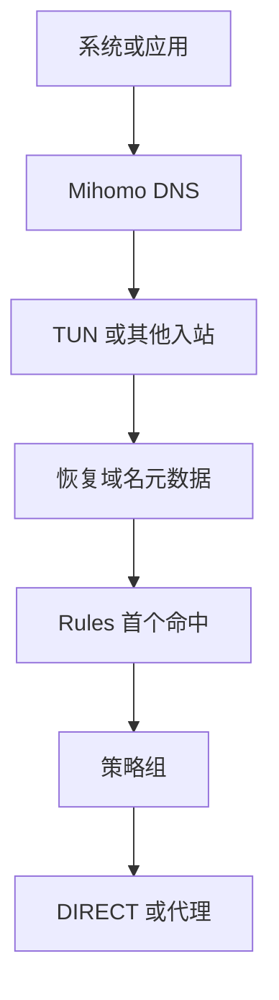

# Design Notes

## 目标与优先级

V4.12 面向手机与电脑本机运行 Mihomo 的场景。设计优先级依次是：

1. 分流语义正确；
2. 手机与电脑行为尽量一致；
3. 局域网和系统服务保持可用；
4. 配置可以解释、检查和回归验证；
5. 最后才考虑减少 YAML 行数或增加可选参数。

模板使用公共 MRS 与自维护文本 Rule Provider，不依赖客户端内置 GeoData；节点完全手工选择，不维护地区筛选和自动策略组。

## 不变量

| 范围 | 必须保持的语义 |
| --- | --- |
| 出口 | `mode: rule`，由路由规则和策略组决定 |
| 默认代理 | 唯一使用 `include-all`，并排除 direct 类型 |
| 业务组 | 只在默认代理与硬直连之间选择 |
| DNS | Fake-IP 默认，Real-IP 例外最小化 |
| Sniffer | 可以恢复域名，不覆盖连接目标 |
| 私网 | TUN 路由排除与 `private_ip` 规则双层保护 |
| 规则数据 | 公共 MRS + 自维护 domain text，不配置 GeoData |
| Adobe | 公共模板默认完全关闭 |
| 安全边界 | `allow-lan: false`，控制 API 只监听回环地址 |

## 流量链路



恢复域名元数据的来源可能是 Fake-IP 映射、DNSMapping 或 Sniffer。Fake-IP / Real-IP 只决定 DNS 返回值，不决定出口；DIRECT / PROXY 只由规则和策略组决定。

## 核心版本

建议使用 Mihomo Core v1.19.10 或更新版本，以获得 Fake-IP TUN 下 DIRECT TCP / UDP 的 `direct-nameserver` 重解析行为。CI 固定使用 v1.19.29，避免“本地解析器认为正确，但真实核心不接受”的情况。

## TUN 与本机边界

TUN 作为手机和电脑的共同基线：

- `stack: mixed`；
- 劫持 TCP / UDP 53 端口 DNS；
- `auto-route: true`；
- `auto-detect-interface: true`；
- RFC1918、链路本地、组播和广播地址绕过 TUN。

`route-exclude-address` 在路由层让本地目标不进入 TUN，`RULE-SET,private_ip,直连,no-resolve` 则在规则层覆盖其他入口或遗漏场景。两者互补，不是重复配置。

`allow-lan: false` 控制其他局域网设备能否访问本机代理端口，与本机能否访问 NAS、路由器、米家设备或 mDNS 不是同一问题。

Clash Verge Rev 等 GUI 客户端可能合并或覆写 TUN / DNS 字段，因此排障时必须查看最终运行配置。

公共模板有意不设置 `strict-route`。它约束操作系统流量是否可能绕过 TUN，而不是改变 Mihomo 的规则匹配顺序；Linux/Android 上可加强路由接管，Windows 上则借助防火墙降低多宿主 DNS 泄漏，但可能干扰 VirtualBox 等网络。这个取舍依赖具体平台，不适合作为手机与电脑共用模板的默认不变量。

## DNS / Fake-IP

```yaml
fake-ip-filter:
  - RULE-SET,private_domain,real-ip
  - RULE-SET,fakeip_compat,real-ip
  - MATCH,fake-ip
```

`private_domain` 负责私有与本地域名；`fakeip_compat` 从 `rules/FakeIPFilter.list` 加载并且只保留：

```text
dns.msftncsi.com
+.msftconnecttest.com
+.services.googleapis.cn
+.xn--ngstr-lra8j.com
+.push.apple.com
+.market.xiaomi.com
+.pub.3gppnetwork.org
+.plex.direct
localhost.*.weixin.qq.com
```

Google Play 例外收窄为 `+.services.googleapis.cn` 与 IDN CDN 后缀，不再用 `+.googleapis.cn` 覆盖其他无需兼容处理的 API 子域。`+.msftconnecttest.com` 恢复 Windows HTTP 联网/门户探测的真实地址，`dns.msftncsi.com` 负责 DNS 探测；这两项不附带 DIRECT 路由语义。`plex.direct` 则必须保留其返回局域网地址的 DNS 语义。

NTP 域名不进入兼容集。Fake-IP 可以映射 UDP，NTP 使用 UDP 123；在没有设备侧复现记录时，系统启动时序不足以证明这些域名必须获得真实地址。真实校时故障应从 UDP 123、TUN 启动时序和系统日志定位，再添加最小例外。

`private_domain` 已覆盖 `localhost.ptlogin2.qq.com` 与 `localhost.sec.qq.com`，所以自维护列表只补充其未覆盖的 `localhost.*.weixin.qq.com`。删除重复项不会改变三类回调的 Real-IP 结果。

`+.pub.3gppnetwork.org` 只覆盖 Wi-Fi Calling 使用的公共 ePDG 命名空间。其 IKE/IPsec 连接使用 UDP 500/4500，已有实际案例确认 Fake-IP 下无法发起、Redir-Host 下恢复；不扩大到整个 `+.3gppnetwork.org`。

传统列表中的四种 Xbox 主机模式只作为文件内注释候选。它们在多个项目中反复出现，但这些列表存在继承关系，现有讨论也只能确认游戏 P2P / NAT / QoS 场景可能需要真实地址，尚不足以证明默认 Fake-IP 必然导致故障。只有用户实际复现并确认根因后才启用。

不恢复整个 `cn_domain -> real-ip`，也不加入通用 STUN、普通游戏、音乐、普通国内外域名或厂商大类例外。ShellCrash、qichiyuhub、wwqgtxx 和 silver716 的常见列表存在继承关系，因此按故障机制筛选而不是取并集。只有存在明确地址语义或跨设备基础服务需要时才进入该列表；单纯需要 DIRECT / PROXY 不是准入理由。

### `private_ip` 与 `198.18.0.0/15`

MetaCubeX `private.mrs` 包含基准测试网段 `198.18.0.0/15`，默认 Fake-IP 池位于其中。Mihomo 处理已确认的 Fake-IP 时，会在进入规则匹配前恢复 Host，并清空映射用的 DstIP，所以 `private_ip,no-resolve` 不会抢走普通 Fake-IP 域名流量。

保留 `no-resolve` 仍然必要：它让 `private_ip` 只检查当前已有目标地址，不为了判断私网而解析域名。

### `direct-nameserver`

`direct-nameserver: [system]` 只在最终确定 DIRECT 后参与真实地址解析。它保留本地运营商、路由器或企业网络的直连解析结果，与默认 DoH 的职责不同。

### `respect-rules`

当前不启用。它控制 DNS 上游连接本身是否进入路由规则，并不控制被查询域名的业务流量出口。

主 DNS 是 AliDNS 与 DNSPod DoH，本来就适合直接连接。启用 `respect-rules` 通常不会改变目标结果，却需要额外处理 `proxy-server-nameserver` 和节点域名的启动依赖。以后如果默认 DNS 改为必须经代理访问的境外 DoH，再重新评估。

### DNS 缓存算法

`cache-algorithm` 支持默认 LRU 和可选 ARC。V4.12 保持参数缺省，继续使用 LRU。没有设备侧缓存命中数据时，不假定 ARC 一定更优，也不为未经验证的收益增加配置分支。

## Sniffer

Sniffer 统一遵循：

| 行为 | 当前选择 |
| --- | --- |
| HTTP / TLS / QUIC 域名识别 | 开启 |
| 纯 IP 流量尝试识别 | `parse-pure-ip: true` |
| 覆盖原始目标 | `override-destination: false` |
| 预设跳过域名 | 无 |
| 强制 Redir-Host DNSMapping 嗅探 | 无 |

`force-dns-mapping` 主要服务 Redir-Host DNSMapping 场景；模板以 Fake-IP 为主，因此不启用。只有问题可复现并确认由嗅探造成时，才增加最小范围的例外。

## 策略组

`🚀 默认代理` 使用：

```text
select
+ include-all
+ exclude-type: direct
```

它直接收纳全部代理节点，并始终保持“代理出口”语义。

业务组只包含：

```text
🚀 默认代理
直连
```

不同业务可以继承默认节点或硬直连，但不能在每个业务组里直接展开全部节点。这样减少重复节点列表，也避免多个业务组各自维护大量具体节点状态。

Apple 组同样提供硬直连和默认代理两个选择，但顺序相反，默认优先直连。

## 进程规则

进程规则放在业务域名规则之前：

- Spotify 进程硬直连；
- Windows `onedrive.exe` 硬直连；
- 包含 `xboxone` 的名称或包名进入 Microsoft 组；
- Android Bing 包名进入 Microsoft 组。

`PROCESS-NAME` 对进程名执行忽略大小写的精确匹配，Android 上也可匹配包名；`PROCESS-NAME-WILDCARD` 使用 `*` / `?` 完成忽略大小写的简单通配。Spotify 和 Xbox 的规则只是子串匹配，因此使用 `*spotify*` 与 `*xboxone*`；只有需要分组、边界或多分支时才使用 `PROCESS-NAME-REGEX`。

三类规则都依赖运行平台提供进程信息。路由器侧无法识别下游终端的具体进程时不会命中。

OneDrive 的特殊设计是有意的：本地客户端可正常直连同步，但网页版需要代理。浏览器不会命中 `onedrive.exe`，随后由 `onedrive_domain` 进入独立策略组。

## 域名和 IP 规则顺序

专用分类位于宽泛父集合之前：

```text
bing / msn / xbox → microsoft
onedrive           → microsoft
github             → microsoft
youtube            → google
geolocation-!cn    → cn_domain
```

V4.12 的自维护 `direct_domain` 位于全部专用业务域名之后、ProxyLite 之前。它是硬直连补充集，不是日常直连全集：普通中国域名和中国 IP 由 `cn_domain` / `cn_ip` 处理。当前 36 条完整覆盖原有的 ScienceDirect、Elsevier、Clarivate / Web of Science 资源，并补充高频科研入口，用于校园或机构出口 IP 认证；不复制 PT、下载进程、国内大厂域名或完整 Scholar 大类。

ProxyLite 继续位于全部专用业务域名和 Direct 之后。ProxyLite 是用户可编辑的 classical 集合，无法预先证明其范围足够窄；将它放在 Bing、OneDrive、GitHub、Microsoft、Apple 等规则前面，会有遮蔽专用策略组的风险。它仍位于 GFW、地域和中国域名等宽泛集合之前。

Apple 使用完整 `apple.mrs`。域名流量由 `apple_domain` 处理，因此 `apple_ip` 使用 `no-resolve`，只兜底已有真实目标 IP 的连接。

`cn_ip` 有意不使用 `no-resolve`。未命中域名集合的目标可以在最后的中国 IP 规则处解析：

```text
解析到中国 IP → 直连
不是中国 IP   → MATCH
```

这会为少量未知域名增加一次 DNS 查询，但保留国内 IP 兜底能力。

`category-ai-!cn` 是境外 AI 聚合集合，并非 OpenAI 专用集合。它位于 Microsoft、GitHub 与 Google 规则之前，因此集合内的 Copilot、Gemini 等域名也会进入 `🤖 ChatGPT` 组。

## Rule Provider 下载语义

规则数据按以下方式组织：

```text
公共域名分类 → domain MRS Rule Provider
服务 / 中国 IP → ipcidr MRS Rule Provider
自维护 Direct  → domain text Rule Provider
ProxyLite      → classical text Rule Provider
Fake-IP 兼容   → domain text Rule Provider
```

HTTP Rule Provider 每 24 小时更新，不指定固定 `proxy`。核心会把更新请求作为内部连接交给正常路由；这表示“不强制出口”，而不是“永远直连”。首次启动或缓存为空时，最终出口还取决于当时已经可用的规则和兜底组。

Proxy Provider 不同：它需要在首次启动时提供代理节点，因此订阅文件固定使用硬直连下载，避免循环依赖。

Adobe classical YAML 规则默认关闭。桌面端如需启用，必须同时恢复路由规则、`&yaml` 锚点和 `adobeisdumb` Provider；手机端保持注释。

## 为什么不用 GeoData

V4.12 不配置 `GEOSITE`、`GEOIP`、`geodata-mode`、`geo-auto-update` 或 `geox-url`。

主要考虑：

1. 手机与电脑引用完全相同的规则 URL；
2. 不依赖客户端本地 GeoData 是否更新、是否包含某个标签；
3. MRS 匹配在本地完成，Provider 更新不会让每次连接访问网络；
4. 数据来源、格式、更新周期和引用关系都能从 YAML 与 CI 直接审计。

## 校验边界

仓库策略脚本负责检查项目不变量，包括：

- 重复 YAML 键和未知顶层字段；
- 策略组、规则目标、Provider 引用；
- ProxyLite 与专用业务规则的相对顺序；
- 自维护 Direct / Fake-IP 文本规则的语法、去重、必要条目与 Provider URL；
- DNS、TUN、Sniffer、进程正则和公开脱敏；
- 配置活动字段注释覆盖；
- README、Changelog、设计说明与 CI 版本同步。

Mihomo `-t` 仍是核心语法和语义的最终校验器。两层检查互相补充：仓库脚本知道项目意图，真实核心知道实际实现。

## 维护原则

新增特殊项前确认：

1. 问题可以稳定复现；
2. 能定位到具体机制；
3. 例外范围可以缩到足够小；
4. 不会被更靠前的规则遮蔽；
5. 已增加相应的回归检查和文档。

默认机制能够正确处理的问题，不继续增加特殊规则或可选参数。

Direct 与 Fake-IP Filter 必须分开判断：前者要求目标硬直连，后者要求应用拿到真实 IP。普通域名只要 Fake-IP 下功能正常，无论国内还是国外，都不进入 `FakeIPFilter.list`。
