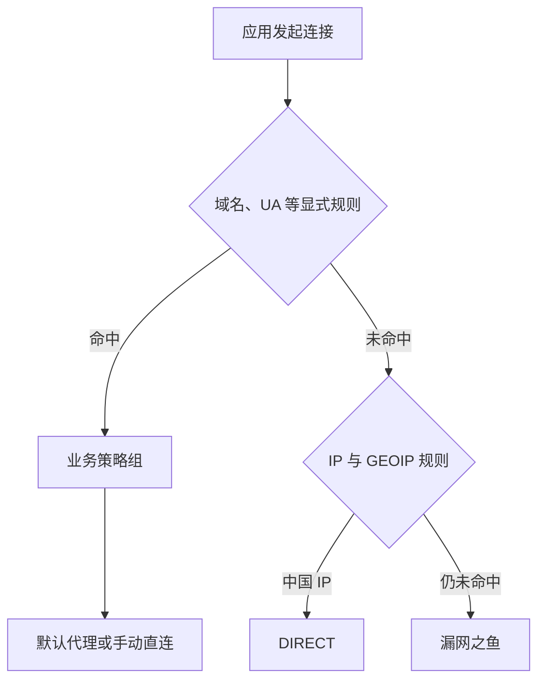

# Shadowrocket 配置逐节说明

本文对应 [`shadowrocket/shadowrocket.conf`](../shadowrocket/shadowrocket.conf)，说明每一部分解决什么问题、为什么采用当前写法，以及它与常见 Shadowrocket 模板有什么不同。

## 审核结论

截至 2026-08-10，本配置的分段、策略引用、DNS 与 Fake-IP 设计可以继续使用。本次复核发现并修复了一个会影响实际分流覆盖的问题：blackmatrix7 的 Apple、Global、China 规则分别拆成 `Name_Domain.list` 与 `Name.list`，旧配置只加载了后者，遗漏了三组中的大部分域名。现在分别使用 `DOMAIN-SET` 和 `RULE-SET` 同时加载两部分。

同时新增 `udp-policy-not-supported-behaviour = REJECT`。当规则要求代理、但所选节点不支持 UDP 时，连接会失败，而不是在用户不知情的情况下改为直连。这个取舍偏向出口一致性和防泄漏；若更看重“无论如何先连通”，可以改成 `DIRECT`，但那会改变“必须代理”的含义。

进一步按 Shadowrocket 的 TUN 特性增加最小旁路路由：私网、Loopback、链路本地、IPv4 组播/广播和 IPv6 mDNS 绕过 TUN，以改善 NAS、Plex、投屏和设备发现。没有照抄常见长列表，也没有排除 Fake-IP 地址池或 Tailscale 使用的 CGNAT 网段。

需要区分三类结论：

- 配置语法、规则格式和上游拆分方式，可由配置文件及上游仓库直接核对；
- DNS、分组和规则的行为依据 LOWERTOP 社区手册。该手册持续同步 Shadowrocket 官方群组资料，但不是开发商的正式技术规范；
- Shadowrocket 是闭源应用，仓库校验无法替代真实 iPhone 上的导入、编译和连接测试。

## 整体工作方式



配置只负责 DNS、策略组和规则。节点与机场订阅保存在 Shadowrocket 首页，不写入公开仓库。这样更换机场不会改动分流配置，更新配置也不会接触订阅凭据。

规则只在首页“全局路由”选择“配置”时按本文逻辑工作。若选择“代理”或“直连”，应用会使用对应的全局模式，不能据此判断本配置的规则是否正确。

## `[General]`：网络与 DNS 基线

### `ipv6 = false`

关闭由本配置启用的 IPv6 解析与连接，以 IPv4 作为兼容性基线。这样可以避免节点、DNS 或本地网络只有一部分支持 IPv6 时出现双栈行为不一致。

它不等于彻底禁止一切 IPv6：如果本地网络和节点域名本身支持 IPv6，Shadowrocket 仍可能用 IPv6 连接节点。需要完全排查 IPv6 问题时，还要检查节点设置、节点域名解析和 iOS 网络环境。

常见模板往往直接启用 IPv6；本配置更保守。只有确认机场节点、蜂窝网络、Wi-Fi 和 DNS 都稳定支持 IPv6 后，才适合改成 `true`。

### `prefer-ipv6 = false`

显式禁止优先选择 AAAA 结果，与 IPv4 兼容基线保持一致。它不能彻底禁止节点域名使用 IPv6，但可以避免配置自身一边关闭 IPv6、一边又优先选择 IPv6 地址。

很多模板依赖默认值而不写此项；这里显式设置是为了防止应用升级或本地 UI 修改造成语义漂移。

### `tun-excluded-routes`

```ini
tun-excluded-routes = 10.0.0.0/8, 127.0.0.0/8, 169.254.0.0/16, 172.16.0.0/12, 192.168.0.0/16, 224.0.0.0/4, 255.255.255.255/32, ff02::fb/128
```

这些地址不进入 Shadowrocket TUN，分别覆盖 RFC 1918 私网、Loopback、IPv4 Link-local、IPv4 组播与广播，以及 IPv6 mDNS。相比只在 `[Rule]` 中写 `DIRECT`，TUN 旁路能让不适合由代理隧道处理的局域网 UDP、设备发现和广播协议直接交给系统网络。

这里有两个有意的缺口：

- 不排除 `198.18.0.0/15`，因为它与 Fake-IP 地址空间重叠；旁路后可能让 Fake-IP 连接根本无法回到 Shadowrocket；
- 不排除 `100.64.0.0/10`，因为 Tailscale 等软件使用该 CGNAT 网段，Shadowrocket 社区资料也特别提示旁路它可能影响 Tailscale。

常见懒人模板还会加入文档示例网段和重复的单播/组播地址。本配置只保留与当前设备使用直接相关的最小集合，降低误绕过范围。

### `dns-server`

```ini
dns-server = https://dns.alidns.com/dns-query, https://doh.pub/dns-query
```

这两个国内 DoH 上游用于 Shadowrocket 需要在本地完成的解析。多个上游会并行查询，并采用较先返回的可用结果。选择国内上游的主要理由是直连域名通常能获得更适合中国网络的 CDN 地址，并且 DoH 比明文 53 端口更不容易被链路中间设备修改。

这里没有加入 Google、Cloudflare 等境外 DNS，也没有给 DoH 指定代理。原因是 Shadowrocket 的 DNS 覆写主要解析直连类域名；代理类域名通常由代理服务器侧解析。使用境外 DoH 并强制代理访问，会增加启动依赖和路径复杂度，对当前分流没有明显收益。

这与许多“国内外 DNS 混合测速”模板不同。本配置不让多个地理区域的 DNS 竞争返回结果，以免直连域名偶然取得不适合本地网络的地址。

### `direct-dns-server = system`

匹配到直连域名规则时，优先使用 iOS 当前网络提供的系统 DNS。它有利于校园网、公司网络、家庭局域网、运营商 CDN 和强制门户等依赖本地解析视角的场景。

它与 `dns-server` 并不矛盾：前者专门面向已经确定为直连的域名，后者是一般 DNS 覆写。当前设计把“明确直连”优先交给系统 DNS，DoH 作为配置内的一般加密上游。

常见模板只设置 `dns-server`，让所有本地解析都走同一组上游；本配置为了机构 IP 认证和本地网络兼容，单独保留系统 DNS 视角。

### `fallback-dns-server = system`

当覆写 DNS 查询失败或超时，回退至系统 DNS。它提升了网络切换、DoH 暂时不可达时的可用性，代价是回退查询不再保证加密。

这个回退主要影响需要本地解析的流量，不应理解成“所有代理域名都会泄漏给系统 DNS”。如果希望严格禁止任何明文回退，可以改成另一个可用的加密 DNS，但必须接受 DoH 全部不可达时域名无法解析。

### `private-ip-answer = true`

允许 DNS 返回 RFC 1918 等私有地址。如果关闭，Shadowrocket 可能把私有地址应答视为 DNS 劫持并强制使用代理，导致路由器、NAS、Plex、本地服务或企业内网无法访问。

常见公共模板也经常启用此项。本配置启用它是为了局域网兼容，不代表所有解析到私有地址的域名都可信；不应把未知公共域名解析到私有地址当成正常现象。

### `icmp-auto-reply = true`

由 Shadowrocket 自动回应 ICMP Ping。它主要用于减少部分应用或网络检测因 VPN 接管后收不到 Ping 应答而误判离线。

这不是代理节点测速，也不会证明真实目标可达。节点延迟仍应使用 Shadowrocket 的 CONNECT 测试。

### `always-real-ip`

Shadowrocket 的 Fake-IP 模式会先向应用返回合成地址，再在内部保留域名映射。`always-real-ip` 让少数不兼容该机制的域名直接获得真实地址。

当前内容与 [`rules/FakeIPFilter.list`](../rules/FakeIPFilter.list) 一一同步：

| 规则 | 保留真实 IP 的理由 |
| --- | --- |
| `dns.msftncsi.com`、`*.msftconnecttest.com` | Windows NCSI 联网与强制门户探测需要预期的真实 DNS/HTTP 语义 |
| `*.services.googleapis.cn`、`*.xn--ngstr-lra8j.com` | Google 中国服务前端兼容；有意不扩大到整个 `googleapis.cn` |
| `*.push.apple.com` | APNs 长连接与系统推送兼容 |
| `*.market.xiaomi.com` | 小米系统服务的已知 Fake-IP 兼容问题 |
| `*.pub.3gppnetwork.org` | Wi-Fi Calling 的 ePDG 主机需要用真实地址建立 IKE/IPsec |
| `*.plex.direct` | Plex 会通过 DNS 返回局域网地址，Fake-IP 会破坏本地安全连接 |
| `localhost.*.weixin.qq.com` | 保留微信本地回调主机名的 localhost 语义 |

其中 Windows、Google Play 和小米条目在单独一台 iPhone 上通常不会命中；保留它们是为了与两端共享的兼容规则保持一致，也方便代理共享等场景。它们的数量很小，不会把普通国内外域名大面积切回 Real-IP。

最重要的边界是：Real-IP 只改变 DNS 返回方式，不决定 `DIRECT` 或代理出口。最终出口仍由 `[Rule]` 决定。NTP 域名没有加入，因为标准 NTP 通常直接使用 IP 或 UDP 123，不需要通过 Fake-IP 域名例外解决；只有出现可复现的域名解析故障时才应增加。

### `hijack-dns`

```ini
hijack-dns = 8.8.8.8:53, 8.8.4.4:53
```

接管应用写死到 Google Public DNS 的 53 端口查询，使其仍进入 Shadowrocket 的 DNS 处理流程。它不会把最终业务流量强制交给某个策略组，也无法拦截应用自己建立的加密 DoH/DoQ 连接。

常见模板可能劫持所有 `*:53`。当前写法只处理两个明确、常见的硬编码目标，范围更小，对局域网自建 DNS 的干扰也更少。

### `udp-policy-not-supported-behaviour = REJECT`

当某条规则要求走代理，但当前节点不支持 UDP 时直接拒绝。这样 Telegram 通话、QUIC、游戏或其他 UDP 业务会明确失败，不会静默改为直连。

常见模板有两种取舍：`DIRECT` 偏可用性，`REJECT` 偏出口一致性。本配置的 `🚀 默认代理` 不提供 `DIRECT`，因此选择 `REJECT` 才与上层策略语义一致。遇到 UDP 业务失败时，应更换支持 UDP 的节点，而不是把这里改成直连作为长期修复。

### `update-url`

指定整份远程配置的更新地址。Shadowrocket 对远程配置执行“更新配置”时，会用仓库版本覆盖本地文件，因此长期修改应提交到仓库；只在手机上临时编辑的内容可能在下一次更新时丢失。

## `[Proxy Group]`：节点选择层

### `🚀 默认代理`

```ini
🚀 默认代理 = select, policy-regex-filter=.*
```

`select` 表示手动选择。`policy-regex-filter=.*` 匹配首页已经导入的全部节点，因此配置不需要知道机场名称，也不需要 `[Proxy]` 段。

这个组不包含 `DIRECT`，所以引用它的规则具有明确的代理语义。含正则筛选的分组不混入显式节点或策略，避免不同版本对混合写法产生不一致解释。

与常见配置相比，这里没有香港、日本、美国等地区组，也没有 `url-test` 自动测速组。优点是结构简单、更换机场无需改正则；缺点是所有业务组共享 `🚀 默认代理` 当前选中的同一个节点，不能让 Netflix 和 ChatGPT 各自固定不同地区。若以后确有地区分流需求，应新增地区组，再把它们加入相应业务组，而不是把节点写进公开配置。

### 业务组

| 分组 | 默认选择 | 设计理由 |
| --- | --- | --- |
| `🐟 漏网之鱼` | `🚀 默认代理` | 未知流量默认代理，同时允许临时切换为直连排障 |
| `🤖 ChatGPT` | `🚀 默认代理` | 汇总 OpenAI、Claude、Gemini、Copilot，避免为每个 AI 建重复组 |
| `📹 YouTube` | `🚀 默认代理` | 独立于 Google，便于视频业务单独开关 |
| `🍀 Google` | `🚀 默认代理` | 处理其他 Google 服务 |
| `👨🏿‍💻 GitHub` | `🚀 默认代理` | 独立于 Microsoft，避免被宽泛微软集合抢先命中 |
| `🐬 OneDrive` | `🚀 默认代理` | iOS 无进程分流，网页版和 App 在此统一处理 |
| `🪟 Microsoft` | `🚀 默认代理` | Bing、Xbox 和其余微软服务共用出口，但规则仍分开便于审计 |
| `🎵 TikTok` | `🚀 默认代理` | 独立处理区域敏感业务 |
| `📲 Telegram` | `🚀 默认代理` | 同时覆盖域名、IP 和 ASN 规则 |
| `🎥 NETFLIX` | `🚀 默认代理` | 便于流媒体解锁与故障排查 |
| `✈️ Speedtest` | `🚀 默认代理` | 可分别测试代理或直连路径 |
| `💶 PayPal` | `🚀 默认代理` | 保留支付服务的独立出口选择 |
| `🍎 Apple` | `DIRECT` | Apple 默认使用本地网络和本地区域服务，遇到地区问题时仍可切换代理 |

除 Apple 外，业务组都是 `select, 🚀 默认代理, DIRECT`；Apple 的顺序相反。顺序决定首次导入或重建分组时的默认选择。

需要注意，这些业务组只能在“共享的默认代理节点”和直连之间切换，不能各自选择不同节点。这是当前轻量架构的明确限制，不是配置错误。

## `[Rule]`：分流判定层

Shadowrocket 会优先处理模块规则，然后处理配置规则；配置内同类规则按从上到下匹配，显式域名规则优先于 IP/GEOIP 推断，`FINAL` 永远兜底。因此专用服务必须放在宽泛厂商和地域集合之前。

### `RULE-SET` 与 `DOMAIN-SET` 的区别

- `RULE-SET` 引用 classical 列表，文件每行自带 `DOMAIN-SUFFIX`、`IP-CIDR`、`USER-AGENT` 等规则类型；
- `DOMAIN-SET` 引用纯域名集，文件每行只有域名或后缀，不带规则类型；
- 两种类型不能互换，否则可能无法编译，或者看似下载成功却没有按预期匹配。

blackmatrix7 的 Apple、Global、China 分别提供 `Name_Domain.list` 与 `Name.list`，并明确要求两者共同加载。这是本配置与大量只抄一条 `RULE-SET` 的简化模板最关键的差异。

### 实际顺序

| 顺序 | 规则层 | 为什么放在这里 |
| --- | --- | --- |
| 1 | Lan | 局域网、保留域名和地址最先直连，避免被后续厂商或地域规则覆盖 |
| 2–5 | OpenAI、Claude、Gemini、Copilot | AI 专用规则先于 Microsoft 和 Google 的宽泛集合 |
| 6–7 | OneDrive、GitHub | 两者都可能被 Microsoft 覆盖，必须先匹配；iOS 不复制 Windows 的 OneDrive 进程直连规则 |
| 8–10 | Bing、Xbox、Microsoft | Bing、Xbox 单列便于未来独立调整；MSN 已由 Microsoft 覆盖，不重复下载一份同策略规则 |
| 11–12 | YouTube、Google | YouTube 先于 Google，保留独立视频策略 |
| 13–14 | Apple Domain Set + classical | 两份共同构成完整 Apple 规则，并在 Global 前默认直连 |
| 15–19 | TikTok、Speedtest、Telegram、Netflix、PayPal | 各自进入独立业务组 |
| 20 | 本仓库 Direct | 机构出口认证等必须直连的补充；不是日常中国域名全集 |
| 21–22 | 本仓库 ProxyLite、ProxyIP | 只处理公共集合未覆盖的个人代理例外；ProxyIP 内部使用 `no-resolve` |
| 23–24 | Global Domain Set + classical | 常见境外域名、关键词、UA 和 IP 的代理兜底 |
| 25–26 | China Domain Set + classical | 常见中国域名、关键词、UA 和 IP 直连 |
| 27 | `GEOIP,CN,DIRECT` | 对前面未命中的目标做中国 IP 兜底 |
| 28 | `FINAL,🐟 漏网之鱼` | 所有未知流量交给可手动切换的最终组 |

Apple Domain Set 与 Global Domain Set 有大量重叠，所以 Apple 必须在 Global 前；否则许多 Apple 域名会代理，违背“全部 Apple 默认直连”的决定。Global 与 China 的 Domain Set 在本次审核时没有精确重复，但两份 classical 列表存在少量 IP/UA 交集；Global 放在前面意味着这些上游已视为境外代理目标的交集项优先代理。

### 为什么 `GEOIP,CN` 不加 `no-resolve`

`no-resolve` 会阻止域名为了 IP 规则而触发解析。本仓库 ProxyIP 和 blackmatrix7 列表中的精确 IP 规则使用它，是为了避免不必要的 DNS 查询。

`GEOIP,CN` 则有意保留解析能力：一个未知国内域名即使没收录在 China Domain Set 中，仍可解析后按中国 IP 直连。这会增加少量本地 DNS 查询，但能显著改善国内长尾站点的直连命中率。若给它加 `no-resolve`，这类域名会落到 `🐟 漏网之鱼` 并默认代理。

### 为什么不使用 `ChinaMaxNoIP`

当前组合已经包含 China Domain Set、China classical 与 `GEOIP,CN`。更大的 `ChinaMaxNoIP` 能增加显式域名覆盖，但会显著扩大远程规则和匹配数据；在已有 IP 兜底时，边际收益有限。本配置选择较轻的 China 组合，不追求把所有国内域名预先列举完。

## `[Host]`：固定本机语义

```ini
localhost = 127.0.0.1
```

确保标准 `localhost` 始终指向本机。这里只保留这一条，不把公共服务域名固定到 IP，因为公共 CDN 地址会变化，静态 Hosts 容易造成失效、跨地区或证书问题。

## 有意省略的部分

| 未配置内容 | 原因 |
| --- | --- |
| `[Proxy]` | 节点和机场订阅保存在 Shadowrocket 首页，避免泄漏凭据并保持两者独立更新 |
| `PROCESS-NAME` | iOS 没有与桌面 Mihomo 等价、稳定的进程分流模型 |
| Adobe | 只在桌面端按需启用，不应进入手机公共配置 |
| MITM、证书、脚本、重写 | 当前目标是纯分流；加入这些能力会扩大隐私、安全和维护边界 |
| 广告拦截 | 与路由分流是不同目标，也容易造成应用功能误伤 |
| `skip-proxy` | 它表示从代理接口转交 TUN，不等于 DIRECT；当前使用 TUN 时没有必要再维护一份域名/IP 清单 |
| 自动地区组和测速组 | 当前只需要手动选择一个默认节点，避免引入机场命名正则和周期测试 |

## 与一般配置的核心差异

| 方面 | 本配置 | 常见一体化模板 |
| --- | --- | --- |
| 节点管理 | 首页单独导入，配置不含节点 | 节点或订阅与配置混在一起 |
| DNS | 直连偏向系统 DNS，一般本地解析使用国内 DoH；代理域名由代理侧解析 | 国内外 DNS 混用，或所有 DNS 强制代理 |
| Fake-IP | 只为可复现故障保留最小 Real-IP 例外 | 把大量国内域名、NTP、游戏和厂商域名全部排除 |
| 服务分组 | 所有代理业务共享一个手选节点，只单独切换 DIRECT | 多地区、多测速、多级自动选择 |
| Apple | 全部 Apple 规则默认直连，并完整加载 Domain/Classical 两部分 | 只处理少数 Apple 域名，或由 Global 兜底 |
| 国内兜底 | China Domain/Classical + GEOIP | 使用更大的 ChinaMaxNoIP 或纯 GEOIP |
| UDP 不支持 | 拒绝，防止静默直连 | 有些模板选择 DIRECT 以优先连通 |
| 局域网与发现协议 | 最小 TUN 旁路 + Lan 直连规则 | 只写 DIRECT，或照抄包含 CGNAT/Fake-IP 风险网段的长旁路列表 |
| 功能边界 | 纯 DNS、分组、规则 | 同时包含去广告、MITM、脚本、重写和节点 |

## 导入后的必要检查

1. 在 Shadowrocket 首页先导入至少一个节点或订阅。
2. 从远程 URL 下载配置，选择“使用配置”或“编译配置”。
3. 在“规则集 URL”中确认所有远程资源均显示下载成功，尤其是 Apple、Global、China 的 `_Domain.list`。
4. 打开 `🚀 默认代理`，确认能看到首页节点并选择一个可用节点。
5. 将首页全局路由设为“配置”，分别测试国内网站、Google、Apple、OneDrive、GitHub 和一个未知域名。
6. 测试路由器、NAS、Plex、AirPlay/投屏或其他局域网设备，确认 TUN 旁路没有被 iOS 本地网络权限阻止。
7. 用“测试规则”确认请求依次命中预期规则和策略组；遇到问题再查看 DNS 日志与代理日志。
8. 测试 Telegram 通话或其他 UDP 业务。如果失败而 TCP 正常，优先更换支持 UDP 的节点。
9. Wi-Fi Calling 还受运营商、iOS VPN 并存限制、网络 UDP 500/4500 和节点能力影响；获得真实 IP 只是必要条件之一，不保证一定能建立通话隧道。

## 维护方法

- 手工维护的共享源只在 [`rules/`](../rules/)；`shadowrocket/rules/` 是生成产物，不直接编辑。
- 修改 `rules/FakeIPFilter.list` 后，必须同步 `always-real-ip`；校验器会逐项检查顺序和内容。
- 调整服务规则时，专用服务必须继续位于 Microsoft、Google、Global 等宽泛集合之前。
- Apple、Global、China 必须同时保留各自的 `DOMAIN-SET` 和 `RULE-SET`。
- 更新配置后运行：

  ```bash
  python3 scripts/build_shadowrocket_rules.py --check
  python3 scripts/validate_shadowrocket.py
  python3 scripts/test_shadowrocket_validator.py
  ```

## 参考资料

- [LOWERTOP/Shadowrocket 社区使用手册](https://github.com/LOWERTOP/Shadowrocket)：配置字段、DNS、策略组和规则语义；该项目明确标注为非官方资料。
- [LOWERTOP 懒人配置（含策略组）](https://github.com/LOWERTOP/Shadowrocket/blob/main/lazy_group.conf)：当前通用字段与代理分组写法参考。
- [blackmatrix7 Shadowrocket 规则目录](https://github.com/blackmatrix7/ios_rule_script/tree/master/rule/Shadowrocket)：公共规则的直接上游。
- [blackmatrix7 Apple](https://github.com/blackmatrix7/ios_rule_script/tree/master/rule/Shadowrocket/Apple)、[Global](https://github.com/blackmatrix7/ios_rule_script/tree/master/rule/Shadowrocket/Global)、[China](https://github.com/blackmatrix7/ios_rule_script/tree/master/rule/Shadowrocket/China)：三组规则均明确要求 Domain Set 与 classical 文件共同使用。
